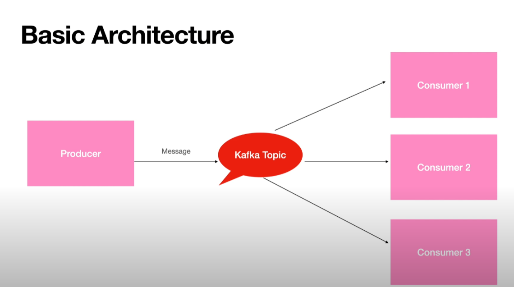
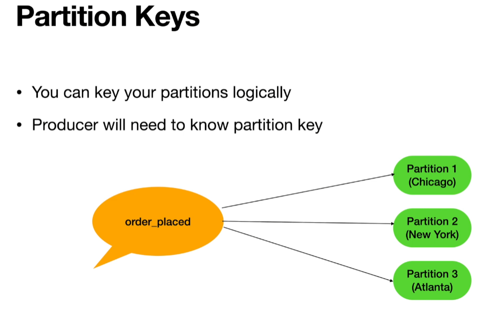
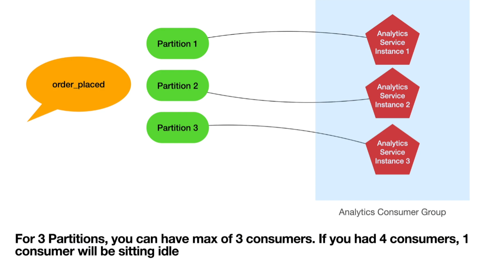

# Kafka Learning

Learning Apache Kafka for streaming data.

## Installation

Going to run Kafka using docker so will not need any installations.

## Set-up

- Type Apache Kafka docker-compose on google and click on the first link, or use this link: https://developer.confluent.io/quickstart/kafka-docker/

- Create a docker-compose file and paste the contents into it.

- Start up the docker-compose file

```
docker-compose up -d
```

Kafka can be used entirely in the CLI, but by adding the control-centre image, it can be used as a GUI.

For that, I accessed the docker-compose from [Data Enginnering Zoomcamp](https://github.com/DataTalksClub/data-engineering-zoomcamp/blob/main/week_6_stream_processing/docker-compose.yml)

After running the docker-compose, the control centre can be accessed in port 9021 on localhost.

## Virtual Environment

Running python on virtual environment

```
pip install virtualenv &&\
python3 -m venv venv
```

Activate the virtual environment

```
source venv/bin/activate
```

Install Kafka on python

```
pip install kafka-python
```

## Producer

- A kafka producer publishes a message to the kafka topic

## Consumer

- A kafka consumer reads the message from the kafka topic and reads in order.



## Partitions

- One topic can have multiple partitions.



Partitioning takes the single topic log and breaks it into multiple logs, each of which can live on a separate node in the Kafka cluster. This way, the work of storing messages, writing new messages, and processing existing messages can be split among many nodes in the cluster..

- Order is maintained within the partition but not across the partitions.

